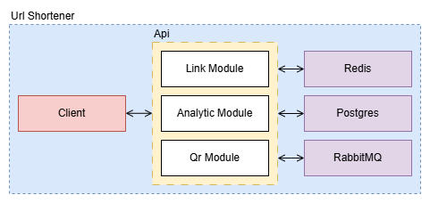

# Modular Monolith Example in .NET

This repository demonstrates a Modular Monolith architecture implemented in .NET, enriched with industry best practices:

- Modular Monolith approach
- Clean Architecture (Onion / Hexagonal)
- CQRS pattern
- Keyed Services
- Asynchronous Messaging with integration events
- Centralized Package Management
- Multiple DbContext management
- Containerization with Docker and Docker Compose



## Overview

This project showcases how to build a modular .NET application that:
- Keeps modules loosely coupled yet deployed as a single unit.
- Enforces separation of concerns via Clean Architecture.
- Implements read/write separation using CQRS.
- Leverages keyed services for runtime binding of implementations.
- Manages multiple EF Core DbContexts in a single solution.
- Uses centralized NuGet package versions for consistency.
- Is fully containerized and orchestrated via Docker Compose.

## Migrations

Each module has its own database context and migrations. The migrations are located in the `Persistence` project of each module. The migrations will be applied to the database when `Api` is started.

To add a migration for a specific module, you can use the following command:

- For `LinkModule`

```bash
dotnet ef migrations add <MigrationName> --project ./Modules/LinkModule/LinkModule.Persistence/LinkModule.Persistence.csproj --startup-project ./Api/Api.csproj --context LinkModuleDatabaseContext
```
- For `AnalyticModule`

```bash
dotnet ef migrations add <MigrationName> --project ./Modules/AnalyticModule/AnalyticModule.Persistence/AnalyticModule.Persistence.csproj --startup-project ./Api/Api.csproj --context AnalyticModuleDatabaseContext
```